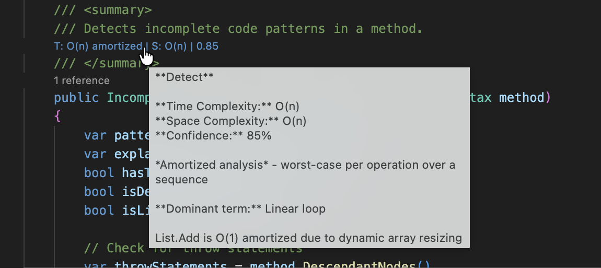

# Complexity Analysis System

**First-class algorithmic complexity analysis for .NET — powered by Roslyn, the Master Theorem, and Akra-Bazzi.**

See Big-O time and space complexity directly in your editor, backed by a rigorous five-phase analysis pipeline that extracts recurrences from C# source code and solves them symbolically.

<p align="center">
  
</p>

<p align="center">
  <em>CodeLens annotations show time complexity, space complexity, confidence scores, and explanatory tooltips — all computed from static analysis of your C# code.</em>
</p>

---

## Features

- **Automatic Big-O extraction** from C# source via Roslyn AST/CFG analysis
- **Recurrence solving** using the Master Theorem, Akra-Bazzi Theorem, and characteristic polynomial method
- **150+ .NET BCL methods** pre-mapped with documented complexities (List, Dictionary, LINQ, String, etc.)
- **Real-time IDE integration** — VS Code CodeLens hints with debounced incremental analysis
- **Amortized, parallel, probabilistic, and memory** complexity analysis
- **Hardware calibration** — micro-benchmarking with curve fitting to verify theoretical predictions
- **Confidence scoring** — every result carries a confidence level so you know when to trust it
- **752 passing tests** across unit, integration, and theorem-specific suites

---

## Quick Start

```csharp
using ComplexityAnalysis.Roslyn.Analysis;
using Microsoft.CodeAnalysis.CSharp;

// Parse your code
var tree = CSharpSyntaxTree.ParseText(sourceCode);
var compilation = CSharpCompilation.Create("Analysis", new[] { tree }, references);

// Analyze
var extractor = new RoslynComplexityExtractor(compilation.GetSemanticModel(tree));
var complexity = extractor.AnalyzeMethod(methodDeclaration);

Console.WriteLine($"Complexity: {complexity.ToBigONotation()}");
// => "Complexity: O(n log n)"
```

### VS Code Extension

```bash
cd src/ComplexityAnalysis.IDE/vscode
npm install && npm run compile && npm run package
# Install the .vsix via "Extensions: Install from VSIX..."
```

Open any C# file and complexity annotations appear above each method signature.

### Running Tests

```bash
cd src
dotnet test
# 752 passed, 42 skipped
```

---

## Architecture

The system operates as a five-phase pipeline, each phase building on the previous to produce increasingly refined complexity estimates:

```
Source Code
    │
    ▼
┌─────────────────────────────────────────────────────┐
│  Phase A — Static Extraction                        │
│  Roslyn AST/CFG analysis, loop bounds, call graph,  │
│  BCL method lookup, mutual recursion detection       │
├─────────────────────────────────────────────────────┤
│  Phase B — Recurrence Solving                       │
│  Master Theorem, Akra-Bazzi, linear recurrence      │
│  (characteristic polynomial), SymPy fallback         │
├─────────────────────────────────────────────────────┤
│  Phase C — Refinement                               │
│  Slack variable optimization, perturbation           │
│  expansion, numerical induction, confidence scoring  │
├─────────────────────────────────────────────────────┤
│  Phase D — Speculative / IDE Integration            │
│  Incremental parsing, incomplete code tolerance,     │
│  stub detection, real-time CodeLens hints             │
├─────────────────────────────────────────────────────┤
│  Phase E — Hardware Calibration                     │
│  Micro-benchmarks, curve fitting, constant factor    │
│  estimation, hardware profiling                      │
└─────────────────────────────────────────────────────┘
    │
    ▼
ComplexityExpression + ConfidenceScore
```

### Component Libraries

| Library | Purpose |
|---------|---------|
| `ComplexityAnalysis.Core` | Expression type hierarchy, recurrence types, variables, visitor pattern |
| `ComplexityAnalysis.Roslyn` | Roslyn-based extractors, loop analysis, call graph, BCL mappings, speculative analysis |
| `ComplexityAnalysis.Solver` | Theorem applicability, critical exponent solver, integral evaluator, refinement engine |
| `ComplexityAnalysis.Calibration` | Micro-benchmarks, curve fitting, constant factor estimation, calibration persistence |
| `ComplexityAnalysis.Engine` | Pipeline orchestration |
| `ComplexityAnalysis.IDE` | VS Code extension (TypeScript) + .NET CLI tool |

---

## Theoretical Foundations

The solver implements three complementary approaches to recurrence solving. This section covers the mathematics behind each.

### Master Theorem

For standard divide-and-conquer recurrences of the form:

$$T(n) = a \cdot T\!\left(\frac{n}{b}\right) + f(n)$$

where *a* ≥ 1 subproblems of size *n*/*b* are created and *f*(*n*) is the non-recursive work. Let *d* = log<sub>*b*</sub>(*a*) be the **critical exponent**. The three cases are:

| Case | Condition | Result |
|------|-----------|--------|
| 1 | *f*(*n*) = O(*n*<sup>*d* − ε</sup>) for some ε > 0 | Θ(*n*<sup>*d*</sup>) |
| 2 | *f*(*n*) = Θ(*n*<sup>*d*</sup> · log<sup>*k*</sup> *n*) | Θ(*n*<sup>*d*</sup> · log<sup>*k*+1</sup> *n*) |
| 3 | *f*(*n*) = Ω(*n*<sup>*d* + ε</sup>) with regularity | Θ(*f*(*n*)) |

Case 3 requires the **regularity condition**: *a* · *f*(*n*/*b*) ≤ *c* · *f*(*n*) for some *c* < 1. The solver verifies this numerically by sampling at multiple input sizes.

**Example:** Merge sort's recurrence *T*(*n*) = 2*T*(*n*/2) + *n* falls into Case 2 with *d* = 1, *k* = 0, yielding Θ(*n* log *n*).

#### Limitations

The Master Theorem cannot handle recurrences with multiple recursive terms, variable *a* or *b*, or driving functions that fall between cases (e.g., *n*<sup>*d*</sup> / log *n*). For these, the system falls back to Akra-Bazzi.

### Akra-Bazzi Theorem

The Akra-Bazzi theorem generalizes the Master Theorem to multi-term recurrences:

$$T(n) = \sum_{i=1}^{k} a_i \cdot T(b_i \cdot n + h_i(n)) + g(n)$$

where *a*<sub>*i*</sub> > 0, 0 < *b*<sub>*i*</sub> < 1, and |*h*<sub>*i*</sub>(*n*)| = O(*n* / log² *n*).

**Solving procedure:**

1. Find the unique critical exponent *p* satisfying:

$$\sum_{i=1}^{k} a_i \cdot b_i^{\,p} = 1$$

   The solver uses Newton-Raphson iteration with Brent's method as a fallback, bracketing the search interval for robust convergence.

2. Evaluate the integral to obtain the closed-form solution:

$$T(n) = \Theta\!\left(n^p \cdot \left(1 + \int_1^n \frac{g(u)}{u^{p+1}}\,du\right)\right)$$

   For common forms of *g*(*n*), the integral has a closed-form result. When *g*(*n*) = *n*<sup>*k*</sup>: if *k* < *p* the integral is O(1); if *k* = *p* it gives O(log *n*); if *k* > *p* it contributes O(*n*<sup>*k* − *p*</sup>).

**Example:** The recurrence *T*(*n*) = *T*(*n*/3) + *T*(2*n*/3) + *n* cannot be solved by the Master Theorem (two different subproblem sizes), but Akra-Bazzi yields *p* = 1 and the solution Θ(*n* log *n*).

### Linear Recurrences (Characteristic Polynomial)

For subtract-style recurrences common in dynamic programming and backtracking:

$$T(n) = \sum_{i=1}^{k} a_i \cdot T(n - i) + f(n)$$

The solver forms the **characteristic polynomial** *x*<sup>*k*</sup> − *a*₁*x*<sup>*k*−1</sup> − ⋯ − *a*<sub>*k*</sub> = 0 and finds its roots. The dominant root determines the asymptotic growth:

| Root type | Contribution |
|-----------|-------------|
| Distinct real root *r* | *c* · *r*<sup>*n*</sup> |
| Repeated root *r* (multiplicity *m*) | (*c*₀ + *c*₁*n* + ⋯ + *c*<sub>*m*−1</sub>*n*<sup>*m*−1</sup>) · *r*<sup>*n*</sup> |
| Complex conjugates α ± βi | *r*<sup>*n*</sup> · (*c*₁ cos(*n*θ) + *c*₂ sin(*n*θ)) |

For order-2 recurrences the solver uses the quadratic formula directly; for higher orders it uses companion matrix eigenvalue decomposition.

**Example:** The Fibonacci recurrence *T*(*n*) = *T*(*n* − 1) + *T*(*n* − 2) has characteristic equation *x*² − *x* − 1 = 0, with dominant root φ = (1 + √5)/2 ≈ 1.618, giving Θ(φ<sup>*n*</sup>).

#### Key Distinction: Subtract vs. Divide

This distinction is critical and a common source of confusion:

| | Subtract (*T*(*n* − *k*)) | Divide (*T*(*n*/*b*)) |
|---|---|---|
| Typical growth | Exponential | Polynomial |
| Solving method | Characteristic roots | Critical exponent |
| Algorithms | DP, backtracking | Merge sort, binary search |
| Example | *T*(*n*) = 2*T*(*n* − 1) → Θ(2<sup>*n*</sup>) | *T*(*n*) = 2*T*(*n*/2) → Θ(*n*) |

---

## Expression Type System

Complexity is represented using a rich expression tree hierarchy rooted at `ComplexityExpression`:

```
ComplexityExpression
├── ConstantComplexity          O(1)
├── LinearComplexity            O(n)
├── PolynomialComplexity        O(n^k)
├── LogarithmicComplexity       O(log n)
├── PolyLogComplexity           O(n^k · log^j n)
├── ExponentialComplexity       O(2^n)
├── FactorialComplexity         O(n!)
├── RecurrenceComplexity        T(n) = aT(n/b) + f(n)
├── AmortizedComplexity         amortized vs. worst-case
├── ParallelComplexity          work / span model
├── ProbabilisticComplexity     expected vs. worst-case
├── MemoryComplexity            stack / heap / auxiliary space
└── BinaryOperationComplexity   +, ×, max, min
```

Expressions compose algebraically (addition, multiplication, max, min) and support a visitor pattern for traversal.

### Variables

Complexity can be parameterized over multiple input dimensions: `InputSize` (*n*), `VertexCount` (*V*), `EdgeCount` (*E*), `TreeHeight` (*h*), `StringLength`, and more.

---

## Advanced Analysis Capabilities

### Amortized Analysis

Detects and annotates amortized costs for patterns like dynamic array resizing (`List<T>.Add` → O(1) amortized), hash table rehashing, and union-find with path compression (O(α(*n*)) amortized).

### Parallel Complexity

Uses the work/span model to analyze `Parallel.For`, `Parallel.ForEach`, PLINQ, `Task.WhenAll`/`Task.WhenAny`, and `async`/`await` patterns, reporting both total work and critical-path span.

### Probabilistic Complexity

Tracks expected vs. worst-case complexity for randomized algorithms, with factory methods for common patterns: QuickSort-like (E[O(*n* log *n*)], W[O(*n*²)]), hash table lookup (E[O(1)], W[O(*n*)]), randomized selection, skip lists, and Bloom filters.

### Memory / Space Complexity

Analyzes stack depth from recursion, heap allocations, tail-call optimization eligibility, and in-place algorithm detection.

---

## BCL Complexity Mappings

Over 150 .NET BCL methods are pre-mapped with complexity information and confidence-level attribution:

| Collection | Key Operations |
|------------|---------------|
| `List<T>` | Add O(1)*, Contains O(*n*), Sort O(*n* log *n*), BinarySearch O(log *n*) |
| `Dictionary<K,V>` | Add O(1)*, TryGetValue O(1)*, ContainsKey O(1)* |
| `HashSet<T>` | Add O(1)*, Contains O(1)* |
| `SortedSet<T>` | Add O(log *n*), Contains O(log *n*) |
| `LINQ` | Where O(*n*), OrderBy O(*n* log *n*), GroupBy O(*n*) |
| `String` | Contains O(*n*·*m*), IndexOf O(*n*·*m*) |

<sub>* amortized</sub>

Confidence levels: **Documented** (MSDN), **Attested** (CLRS), **Empirical** (benchmarked), **Inferred** (code-derived), **Heuristic** (conservative estimate).

---

## Hardware Calibration

Phase E can micro-benchmark your machine to verify theoretical complexity predictions and estimate constant factors in nanoseconds:

```csharp
var calibrator = new BCLCalibrator();
var results = await calibrator.RunFullCalibration(BenchmarkOptions.Standard);

// Results include:
// - Constant factor per operation (ns)
// - R² goodness-of-fit scores
// - Hardware profile (CPU, memory, OS, runtime)
```

Calibration data is persisted as JSON for reuse across sessions.

---

## Project Structure

```
ComplexityAnalysis.sln
├── src/
│   ├── ComplexityAnalysis.Core/          # Type system, recurrences, variables
│   ├── ComplexityAnalysis.Roslyn/        # Roslyn extractors, BCL mappings, speculative analysis
│   ├── ComplexityAnalysis.Solver/        # Theorem solving, critical exponent, refinement
│   ├── ComplexityAnalysis.Calibration/   # Micro-benchmarks, curve fitting
│   ├── ComplexityAnalysis.Engine/        # Pipeline orchestration
│   ├── ComplexityAnalysis.IDE/
│   │   ├── vscode/                       # VS Code extension (TypeScript)
│   │   └── Cli/                          # .NET CLI tool
│   └── ComplexityAnalysis.Tests/         # 752 tests (xUnit)
├── docs/articles/                        # Technical documentation
└── assets/
    └── vscode-codelens.png
```

---

## Technology Stack

- **.NET 8.0** — target framework
- **Roslyn** (Microsoft.CodeAnalysis) — C# syntax and semantic analysis
- **MathNet.Numerics** — root finding, numerical methods
- **xUnit** — test framework
- **TypeScript** — VS Code extension
- **SymPy** (optional) — symbolic integral evaluation for advanced recurrences
- **DocFX** — API documentation generation

---

## Contributing

1. Fork the repository
2. Create a feature branch
3. Run tests: `cd src && dotnet test`
4. Submit a pull request

See [`PHASES_AND_MILESTONES.md`](PHASES_AND_MILESTONES.md) for current implementation status, test inventory, and upcoming work.

---

## License

MIT
